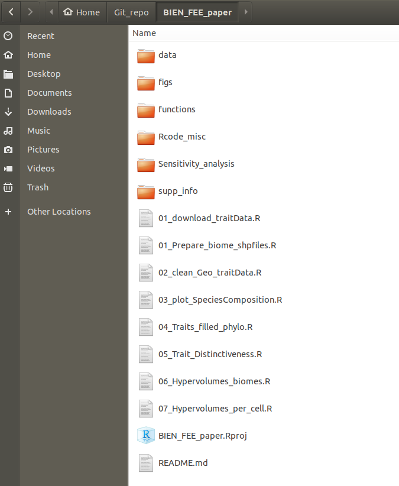
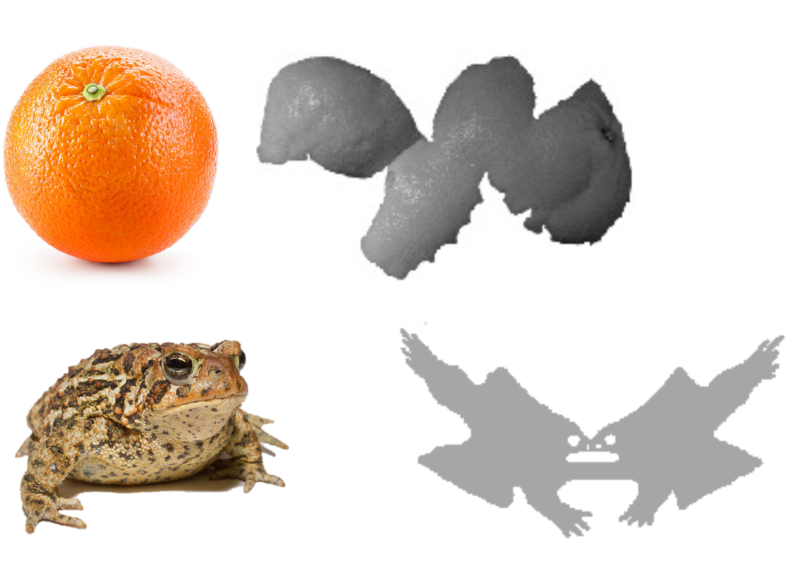
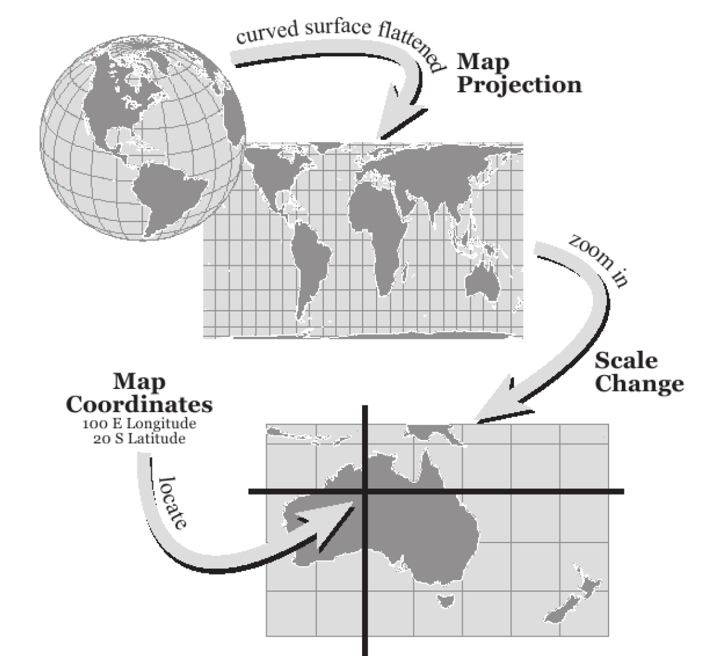
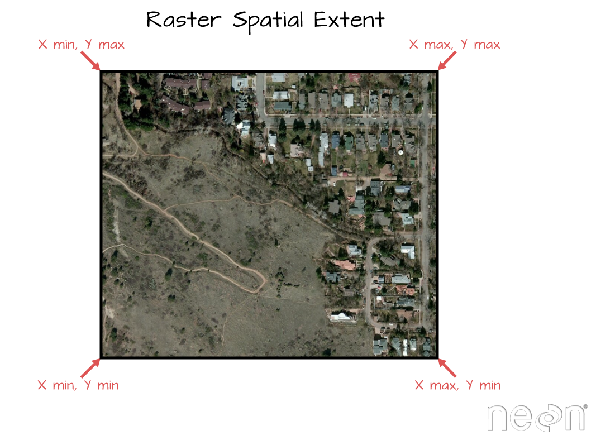

```{r setup, include=FALSE}
knitr::opts_chunk$set(echo = TRUE)
```

# Pre-requisitos e instalación de paquetes

Lista de paquetes espaciales en R [https://cran.r-project.org/web/views/Spatial.html](https://cran.r-project.org/web/views/Spatial.html)

```{r cars, eval=FALSE, include=TRUE, echo=TRUE}
install.packages(c("rgdal","rgeos", "maptools", "raster", "sp", "sf"))
```
Paquetes generales: 

 * maptools: manipulación de datos geográficos
 * raster: Lectura, escritura, manipulación, análisis y modelamiento de datos espaciales en cuadrículas. 
 * sp: clases y métodos de datos espaciales (Pebesma & Bivand, 2018). 
 * rgdal: provee enlaces a la libreria geoespacial GDAL y acceso a las operaciones de proyección y transformación de la libreria PROJ4 (Bivand et al., 2017). 
 * sf: combinación estandarizada de funciones en sp, rgeos y rgdal para la manipulación de datos espaciales vectorizados  (Pebesma, 2017)
 

## Organización y creación de proyectos en R

[Guide to reproducible code (British Ecology Society)](https://www.britishecologicalsociety.org/wp-content/uploads/2017/12/guide-to-reproducible-code.pdf)

1. Crear un nuevo projecto en R
2. Crear carpetas básicas (e.g., ./data, ./figs, ./functions, ...)

``` 
└── my_awesome_project
    ├── src
    ├── output
    ├── data
    │   ├── raw
    │   └── processed
    ├── README.md
    ├── run_analyses.R 
    └── .gitignore

``` 
Fuente: https://www.r-bloggers.com/structuring-r-projects/



## Ejercicio # 1:

- Crear un projecto de R
- Crear carpetas básicas para la práctica
- Abrir el projecto
- Crear un 'R script'
- Crear etiquetas como `librerias` y `datos` dentro del script `(shortcut: Crtl+Shift+R)`

# Representación simple de datos espaciales

## Tipos básicos de R

* Números

``` 1 or 2 or 4000 or 10e9... ```

* Cadenas (or characters) 

``` "Hola mundo" ```

* Operadores lógicos 

``` "TRUE" or "FALSE" ```

* Vectores 

``` c(1, 2) or c("uno", "dos") ```

* Matrices

```{r}
matrix(data = c(c(1,2), c("Bucaramanga", "Bogotá")), nrow = 2, ncol = 2) 
```

* Data frames

```{r}
data.frame(Num = c(1,2), Nombre = c("Bucaramanga", "Bogotá"))
```

## Puntos geográficos

```{r}

x <- c(-73)
y <- c(7.13)

## Colombia continental
## Punta gallinas (lat= 12.46, lon = -71.67)
## Isla San José, Rio Negro Guainia Colombia (1.34, -66.7)
## Cabo Manglares (1.65, -79.01)
## Leticia (-4.23, -69.95)
plot(x, y, xlim = c(-79.01, -66.7), ylim = c(-4.23, 12.46))
# Bogotá
abline(h = 4.71, v = -74.07)
```

```{r}
## Quibdo 5.69, -76.65 (max 851.7 mm)
## Medellin 6.24, -75.76 (226.7 mm)
## Bogota 4.71, -74.07 (119 mm)
## Bucaramanga 7.13, -73 (149 mm)
lon = c(-76.65, -75.76, -74.07, -73)
lat = c(5.69, 6.24, 4.71, 7.13)
ciudades = cbind(lon, lat)
precip = c(852, 227, 119, 149)

psize <- 1 + precip/500
plot(ciudades, cex=psize, pch=20, col='red', main='Precipitación', xlim = c(-79.01, -66.7), ylim = c(-4.23, 12.46))
```

https://rstudio.com/wp-content/uploads/2015/03/ggplot2-cheatsheet.pdf

```{r message=FALSE, warning=FALSE}
library(tidyverse)
ciudades2 <- data.frame(x = lon, y = lat, precip = precip, nombre = c("Quibdo", "Medellín", "Bogotá", "Bucaramanga"))

ciudades2 %>% 
ggplot(aes(x = lon, y = lat)) +
  geom_point(size = 1 + precip/500) +
  xlim(c(-79.01, -66.7)) +
  ylim(c(-4.23, 12.46))
  
```

# Objetos espaciales

## Vectores

### Puntos geográficos

```{r}
library(sp)
library(mapview)
library(tmap)

ciudades_geo <- ciudades2
coordinates(ciudades_geo) <- ~x+y
```

```{r}
class(ciudades_geo)
ciudades_geo
```

```{r}
mapview(ciudades_geo, zcol = "nombre")
```

## Proyecciones y sistema de coordenadas

Forma en que los datos espaciales son "aplanados" en un espacio 2D



**"Alineación incorrecta de dos objetos espaciales = diferentes proyecciones"**


Fuente: National Ecological Observatory Network (NEON)

## Sistema de coordenadas


Fuente: Maning Sambale


```{r}
proj4string(ciudades_geo) <- "+proj=longlat +datum=WGS84"
mapview(ciudades_geo, zcol = "nombre")
ciudades_geo
```

## Extensión espacial

Coordenadas X y Y de las esquinas en el espacio geográfico


Fuente: National Ecological Observatory Network (NEON)

## Polígonos

```{r}
library(maptools)
data("wrld_simpl")

print(wrld_simpl)
```

```{r}
plot(wrld_simpl)
```

### Filtración o subset (e.g., Colombia)
```{r}
Col_inx <- which(wrld_simpl$NAME == "Colombia")
Col_poly <- wrld_simpl[Col_inx,]

plot(Col_poly)
plot(ciudades_geo, add = TRUE, col = "red", cex = 1 + ciudades_geo$precip/500, pch = 16)
```

```{r}
Col_inx <- which(wrld_simpl$NAME == "Colombia")
Col_poly <- wrld_simpl[Col_inx,]

plot(Col_poly, axes = TRUE, col = "lightyellow")
plot(ciudades_geo, col = "orange", cex = 1 + ciudades_geo$precip/500, pch = 16, add = TRUE)
```

```{r}
plot(wrld_simpl, xlim = c(-81,-67), ylim = c(-4,12), axes = TRUE, col = "lightyellow")
plot(ciudades_geo, col = "orange", cex = 1 + ciudades_geo$precip/500, pch = 20, add = TRUE)
```

```{r}
plot(wrld_simpl, xlim = c(-81,-67), ylim = c(-4,12), axes = TRUE, col = "lightyellow")
plot(Col_poly, col = "orange", add = TRUE)
plot(ciudades_geo, col = "red", cex = 1 + ciudades_geo$precip/500, pch = 20, add = TRUE)
```

```{r}
mapview(Col_poly, col.regions = "orange") + mapview(ciudades_geo, zcol = "nombre")
```

## Cambiar la proyección de vectores

Lista de proyecciones disponibles
```{r eval=FALSE, include=TRUE}
rgdal:::projInfo()
```

```{r}
wrld_simpl2 <- spTransform(wrld_simpl, CRS("+proj=laea"))

par(mfrow = c(1,2))
plot(wrld_simpl)
plot(wrld_simpl2)
```


```{r}
## Lambert Azimuthal Equal Area
ciudades_geo2 <- spTransform(ciudades_geo, CRS("+proj=laea"))

par(mfrow = c(1,2))
plot(ciudades_geo, col = "red", pch = 16, axes = TRUE)
plot(ciudades_geo2, col = "blue", pch = 16, axes = TRUE)
```

```{r}
plot(Col_poly, col = "orange", axes = TRUE)
plot(ciudades_geo2, col = "red", cex = 1 + ciudades_geo$precip/500, pch = 20, add = TRUE)
```

```{r}
Col_poly2 <- spTransform(Col_poly, CRS("+proj=laea"))

plot(Col_poly2, col = "orange", axes = TRUE)
plot(ciudades_geo2, col = "red", cex = 1 + ciudades_geo$precip/500, pch = 20, add = TRUE)
```

## Ejercicio #2: 

- Busca en internet las coordenadas de 3 ciudades
- Crea un data frame con el nombre de la ciudad y las coordenadas
- Crea una gráfica de los puntos con los límites deseados usando plot o ggplot 
- Convierte el data frame en `SpatialPointsDataFrame`
- Grafíca los puntos con diferentes proyecciones geográficas sobre un mapa de polígonos


## Rasters 

- Datos espaciales en cuadrículas ("gridded data")
- Las cuadrículas representan areas de la tierra como pixeles


Fuente: National Ecological Observatory Network (NEON)

### Resolución espacial

Tamano de cada cuadrícula (usualmente en metros)


Fuente: National Ecological Observatory Network (NEON)


In this exercise, we are going to use raster data that represent 'bioclimatic variables' from the WorldClim database (http://www.worldclim.org, Hijmans et al., 2004)

### Datos climáticos

Base de datos de Worldclim
http://worldclim.org/bioclim

* BIO1 = Annual Mean Temperature
* BIO5 = Max Temperature of Warmest Month
* BIO6 = Min Temperature of Coldest Month
* BIO7 = Temperature Annual Range (BIO5-BIO6)
* BIO8 = Mean Temperature of Wettest Quarter
* BIO9 = Mean Temperature of Driest Quarter
* BIO12 = Annual Precipitation
* BIO16 = Precipitation of Wettest Quarter
* BIO17 = Precipitation of Driest Quarter
* BIO18 = Precipitation of Warmest Quarter
* BIO19 = Precipitation of Coldest Quarter

```{r}
library(dismo)
library(raster)
# Descargar los datos directamente
bio_ly <- getData("worldclim", var="bio", res=10, path="./data/")

## Group of raster layers
class(bio_ly)

names(bio_ly)

tempRast <- bio_ly$bio1/10
precipRast <- bio_ly$bio12

tempRast
precipRast 
```

http://worldclim.org/bioclim

```{r}
# Desde una carpeta
precipRast <- raster("./data/wc10/bio12.bil")
precipRast 
```


### Introducción al paquete "sf"

```{r}
library(sf)

## Quibdo 5.69, -76.65 (max 851.7 mm)
## Medellin 6.24, -75.76 (226.7 mm)
## Bogota 4.71, -74.07 (119 mm)
## Bucaramanga 7.13, -73 (149 mm)

# Coleccion de rasgos simples (Simple features collection, sfc)
# Crear varios sf
p1 <- st_point(c(5.69, -76.65))
p2 <- st_point(c(6.24,  -75.76))
p3 <- st_point(c(4.71, -74.07))
p4 <- st_point(c(7.13, -73))

# Juntar varios puntos en un sfc 
ciudades_points <- st_sfc(p1, p2, p3, p4, crs = 4326)

ciudades_info <- data.frame(num = 1:nrow(ciudades2), nombre = c("Quibdo", "Medellín", "Bogotá", "Bucaramanga"), precip = ciudades2$precip)

ciudades_geo <- st_sf(ciudades_info, geometry = ciudades_points)
```


```{r}
plot(ciudades_geo, axes = TRUE)
```


```{r}
plot(st_geometry(ciudades_geo), axes = TRUE)
plot(ciudades_geo["precip"], axes = TRUE, pwd = 16)

```

```{r}
ciudades_geo[ciudades_geo$nombre == "Quibdo",]

plot(st_geometry(ciudades_geo[ciudades_geo$nombre == "Quibdo" | ciudades_geo$nombre == "Medellin" ,]))

ciudades_geo %>% 
  filter(nombre == "Quibdo" | nombre == "Medellin") %>% 
  st_geometry() %>% 
  plot()
```

```{r}
library(mapview)

mapview(ciudades_geo["nombre"])
mapview(ciudades_geo["precip"])
```